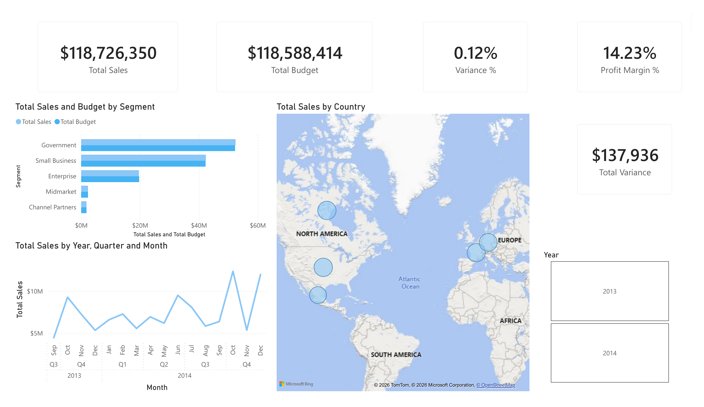
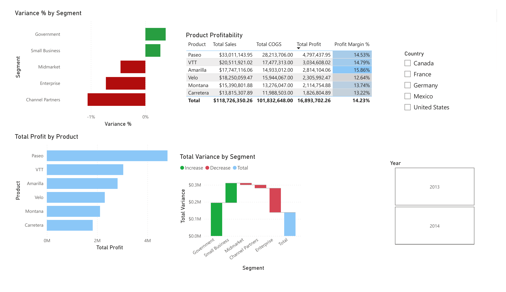

# Finance Budget Dashboard

A two-page Power BI dashboard analyzing sales, budget variance, and product profitability, built on top of an Excel-based data cleaning and validation workflow.

Here are the two dashboard images:
**Overview**

 
**Deep Dive**

 
## Project overview
 
This project explores 700 records from Microsoft's official [Financial Sample dataset](https://learn.microsoft.com/en-us/power-bi/create-reports/sample-financial-download), covering Sept 2013–Dec 2014 across 5 segments, 5 countries, and 6 products. The goal was to clean and model the data in Excel and Power BI, then build a finance-style dashboard answering:
 
- How did actual sales compare to budget, by segment?
- Which products are the most profitable?
- How did sales trend across the time period, and by country?
**A note on the Budget figures:** this dataset includes actual Sales, COGS, and Profit, but no real budget — companies don't publish internal planning numbers. The `Budget` column in this project is **simulated** (`Budget = Sales × a random factor between 85%–115%`), which is standard practice for a budget-variance learning project when real planning data isn't available. This means the Variance % and Variance-by-Segment findings below demonstrate the *technique* of budget-variance analysis rather than a real business finding — there's no actual story behind which segment beat or missed budget, since the numbers are randomized by construction. The Sales, COGS, and Profit figures, by contrast, are real data from the original dataset.
 
## Tools used
 
- **Excel** — data cleaning, simulated budget generation, pivot table validation
- **Power BI** — data modeling, DAX measures, interactive dashboard
## Process
 
1. **Data cleaning (Excel)**
   - Renamed the `" Sales"` column (it shipped with a leading space in the raw file)
   - Added a simulated `Budget` column, then pasted it as static values so the numbers stay fixed on reopening
   - Added `Variance` and `Variance %` columns
   - Validated Sales/Budget/Variance totals by segment with a pivot table before modeling
2. **Data modeling (Power BI)**
   - Fixed "United States of America" → "United States" so the filled map could geocode it correctly
   - Built a dedicated Date table (`CALENDAR()`), added Year/Quarter/Month/MonthNum columns, and built a Year → Quarter → Month → Date drill-down hierarchy
   - Related the Date table to the fact table — required to get the trend line and time-based slicing working
   - Wrote DAX measures: Total Sales, Total Budget, Total Variance, Variance %, Total Profit, Profit Margin %
3. **Dashboard design**
   - Page 1 (Overview): KPI cards, Sales vs. Budget by segment, sales trend by month, sales by country, Year slicer
   - Page 2 (Deep Dive): Variance % by segment (color-coded green/red), Total Profit by product, a Variance waterfall bridging Budget to Actual, a product profitability table, Country slicer (synced with Page 1)
   - Applied the Storm theme for a navy/blue palette distinct from this portfolio's other two dashboards, with sentiment colors (green/red) explicitly set for the waterfall and variance chart
## Key insights
 
- **Sales tracked budget closely overall** — $118.73M actual vs. $118.59M budgeted, a 0.12% variance at the company level. (As noted above, this closeness is a property of how the simulated budget was generated, not a real planning outcome.)
- **Paseo is the most profitable product** at $4.8M total profit and a 14.53% margin, while Amarilla has the highest margin of any product (15.86%) despite lower total profit than Paseo — a useful distinction between *margin* and *volume* as separate measures of product performance. These are real, non-simulated findings.
- **Sales show a clear Q4 seasonal pattern** in both 2013 and 2014, with October and December consistently among the strongest months in the dataset.
- **Government and Small Business were the two segments with positive variance** in this run of the simulation; re-running the random Budget generation would likely shift which segments land on either side.
## Files in this repo
 
| File | Description |
|---|---|
| `Finance_Budget_Dashboard_PowerBI.pbix` | Power BI dashboard file |
| `Finance_Budget_Cleaned_Data.xlsx` | Cleaned dataset with simulated budget and pivot table validation |
| `screenshots/` | Dashboard page exports |
 
## Possible next steps
 
- Replace the simulated Budget column with a rule-based budget (e.g., prior year actual + a fixed growth target) to make the variance story more realistic than pure randomness
- Add a Discount Band vs. Profit Margin view, since this dataset's discount tiers haven't been explored yet
- Break out COGS as a % of Sales by product, to see whether margin differences are driven more by pricing or by cost
